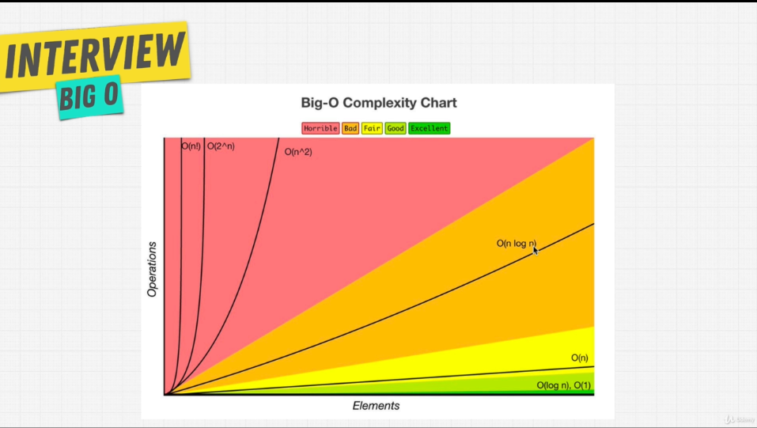
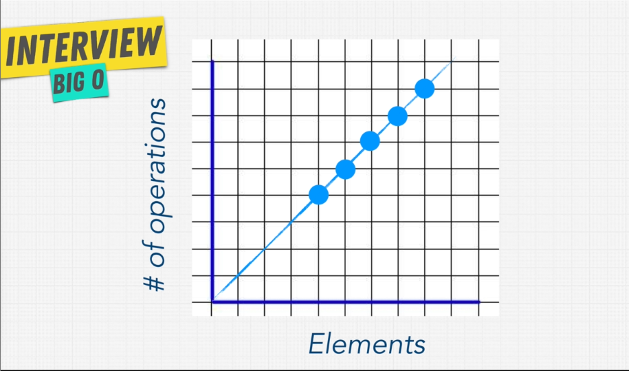
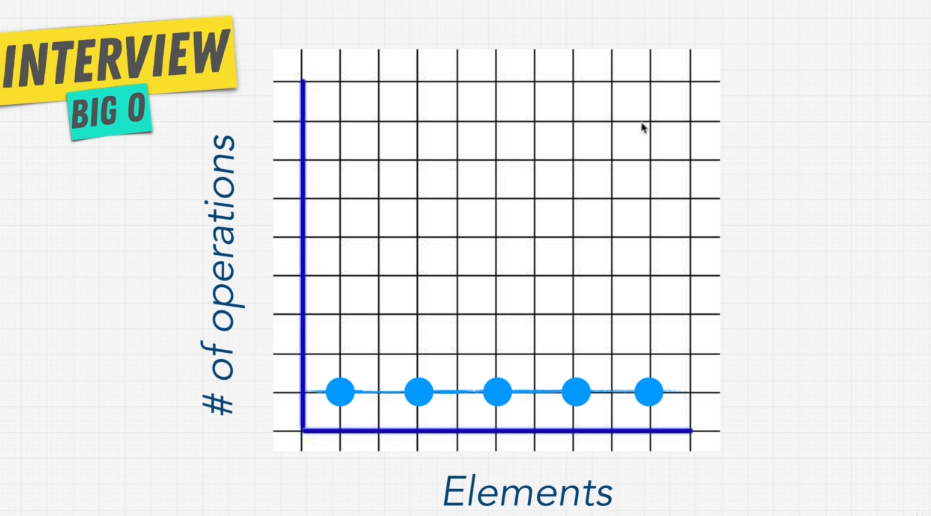
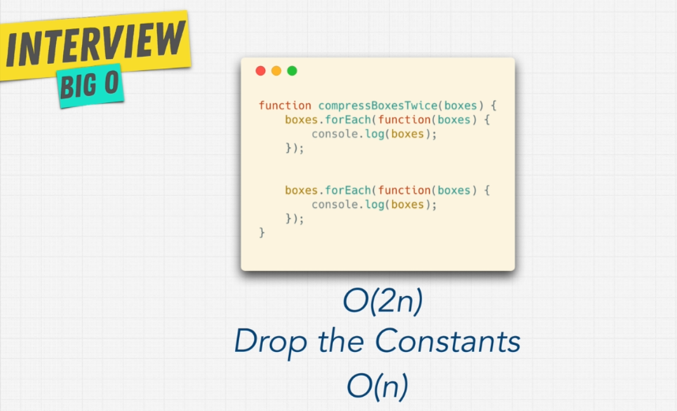
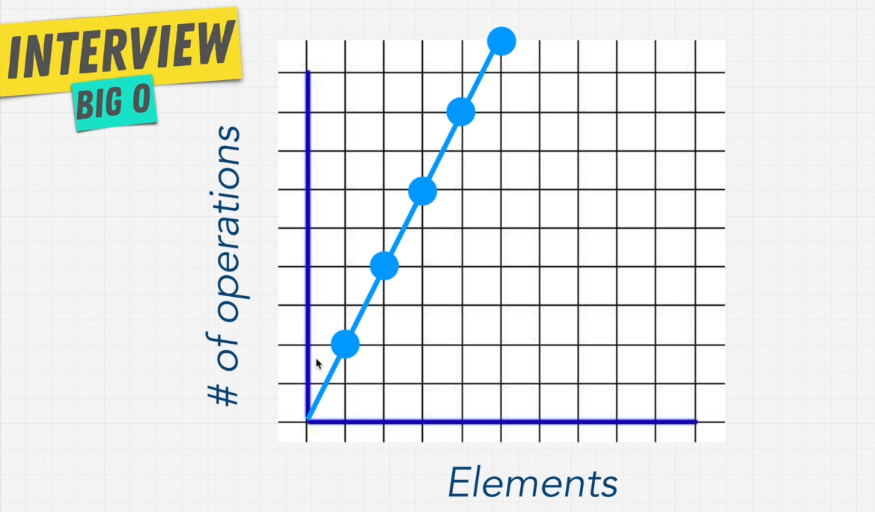
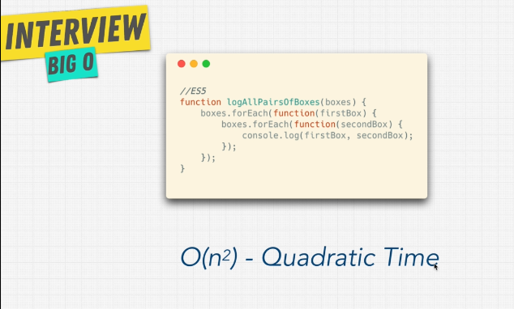
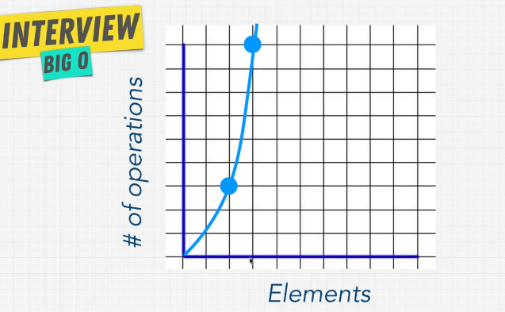
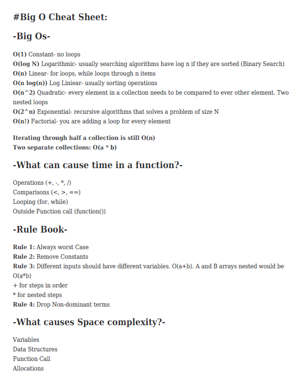

# Big O

It is the most important topic in any Data stucture and Algorithm that we will
go throught and it will differenciate good code with bad code.

## What is Good Code

When we talk about good code there are two major things that we need to check

1. Readable : How clean is your code for review by other programmers.
2. Scalabe : It is where **Big O** comes into play

Imagine You want to make Maggi for that you need a recipe which you will then
pur into action in the kitchen and wallah your maggi is ready. Similarly your
code is like a recipe which is given to a device that lead to a result. Now like
there are different ways to make a Maggi in the same way there are **Different
ways to solve a problem using code**.

```javascript
//Here is a small example to understand

const nemo = ["nemo"];

function findNemo(array) {
  let t0 = performace.now();
  //The performance. now() method returns a high resolution timestamp in milliseconds
  for (let i = 0; i < array.length; i++) {
    if (array[i] === "nemo") {
      console.log("Found NEMO!");
    }
  }
  let t1 = performace.now();
  console.log("Call to find Nemo Took" + (t1 - t0) "milliseconds");
}

findNemo(nemo);
```

The result would be something like `Call to find Nemo Took 0.10000 milliseconds`
or so.

But as the array will become larger and larger for like 100 or 1000 or more
times larger then then the time will keep getting increased, so

```js
const large = new Array(100000).fill("nemo");
findNemo(large);
```

will give time of about `343.19999..` milliseconds or so.

Although the thing here to be remember is this time depends on many factorys
like the computer we are using it's CPU, What programs running in the background
what language we are using etc. according to which it would be lot faster or lot
slower.

This way is not good to know if your program and others program is faster or
slower depending on algorithms they use and that's where Big O come into play.

_Big-O- notation is the language we use for talking about how long an algorithm
takes to run_



Now lets talk about how we will calculate the Big O of `findNemo()` function

Below is the graph showing the number of operations the functions has to perform
to find nemo as the elements increases



hence `findNemo()` function has a O(n) --> Linear Time Complexity, where n is
the number of inputs

### O(1) -> Constant Time Complexity

Imagine you have a function

```js
function compressFirstBox(boxes) {
  console.log(boxes[0]);
}
```

just the fisrt item is printed in the console. Below is the graph to show it.



but imagine if we have another console.log function in our main function like
`console.log(boxes[1])` then both the console.log have a O(1) then would the
final result would be O(2) well yes actual but it's still a flat line in the
graph and as the operation increase the line moves upward but yet remains flat.
So no matter how many operation gets add here the overall **Big O will remain
O(1)**

Keep in mind : Input can be any type of data not just arrays

## Challenge: Find Big O of this function.

```js
function funChallenge(input) {
  let a = 10;
  a = 50 + 3;

  for (let i = 0; i < input.length; i++) {
    anotherFunction();
    let stranger = true;
    a++;
  }
  return a;
}

funChallenge();
```

### Solution

```js
function funChallenge(input) {
  let a = 10; //O(1)
  a = 50 + 3; //O(1)

  for (let i = 0; i < input.length; i++) {
    //O(n) in a loop everything depends on the input
    anotherFunction(); // O(n)
    let stranger = true; //O(n)
    a++; //O(n)
  }
  return a; //O(1)
}

funChallenge();
```

Big O (3 + 4n) which can be simplified to just **O(n)** But there is a simplier
way to solve this problem rather than calculating it line by line.

## Rule Book

- Rule 1: Worst Case
- Rule 2: Remove Constants
- Rule 3: Different terms for inputs
- Rule 4: Drop Non Dominants

### Big O Rule 1 (Worst Case)

We talked about the Finding Nemo Function now suppose the array is too large and
has different data apart from "nemo" now the best case would be that nemo is
present at the first index and if we add a `break;` after we found nemo then the
Big O would be O(1) but we have to look for the worst case and in this case the
worst case would be that nemo is present at the last in that case the Big O
would be O(n) and that is what we will look at.

### Big O Rule 2 (Remove Constants)

Let see an example to understand this topic.

```js
function itemsPrint(items) {
  console.log(items[0]); //O(1)

  var middleIndex = Math.floor(items.length / 2);
  var index = 0;

  while (index < middleIndex) {
    //O(n/2)
    console.log(items[index]);
    index++;
  }

  for (var i = 0; i < 100; i++) {
    //O(100)
    console.log("hi");
  }
}
```

O(1 + n/2 + 100) => O(n/2 + 101) => O(n/2 + 1) _101 is just 1 overall_ =>
O(n + 1) _Drop the constants_ => O(n) _If n is huge the 1 doesn't matter_

Here is another solution to demonstrate Rule 2




### Big O Rule 3 (Different terms for inputs)

Example code to demonstrate the rule

```js
function compressBoxesTwice(boxes, boxes2) {
  boxes.forEach(function (boxes) {
    console.log(boxes);
  });

  boxes2.forEach(function (boxes) {
    console.log(boxes);
  });
}
```

**O(a + b)** this will be the Big O of this function

### Big O of loop within loop

```js
const boxes = [1, 2, 3, 4, 5];

function logAllPairsOfArray(array) {
  for (let i = 0; i < array.length; i++) {
    for (let j = 0; i < array.length; j++) {
      console.log(array[i], array[j]);
    }
  }
}

logAllPairsOfArray(boxes);
```

Big O of this function is `O(n*n)` => `O(n^2)`




### Big O Rule 4 (Drop Non Dominants)

If in a function we are getting Big O something like `O(x^2 + 3x + 100 + x/2)` then according to this rule we will take only the higest value as our Big O and drop the rest assuming that the value of x is too high so in this case we drop the dominants and the Big O will be simply `O(n^2)`

# Below is the Big O Cheat Sheet


[Big-O-Cheat-Sheet]: (https://www.bigocheatsheet.com/)

Check out this website for a complete cheat sheat [Big-O-Cheat-Sheet]

The worst of all the Big O is `O(n!)` which should not be implemented as it is terible

```js
void nFacRuntimeFunc(int n) {
  for(int i=0; i<n; i++) {
    nFacRuntimeFunc(n-1);
  }
}
```

**O(n!) - The Worst**

## Which code is Best


## Space Complexity

Speed is a factor sure but having to many boxes might result in shortage of memory and the boxes might overflow.

### What causes space complexity?

- Variable
- Data Structure
- Function Call
- Allocation

_Example:_

```js
function boo(n) {
  for (let i = 0; i < n.lenght; i++) {
    console.log("Boooo!");
  }
}
boo([1, 2, 3, 4, 5]); //The space complexity of this function is O(1) as the array is not playing any role here

function arrayOfHiNTimes(n) {
  let hiArray = [];
  for (let i = 0; i < n; i++) {
    hiArray[i] = "hi";
  }
  return hiArray;
}

arrayOfHiNTimes(6); //O(n) because array data struture and allocation is done as per the size
```
