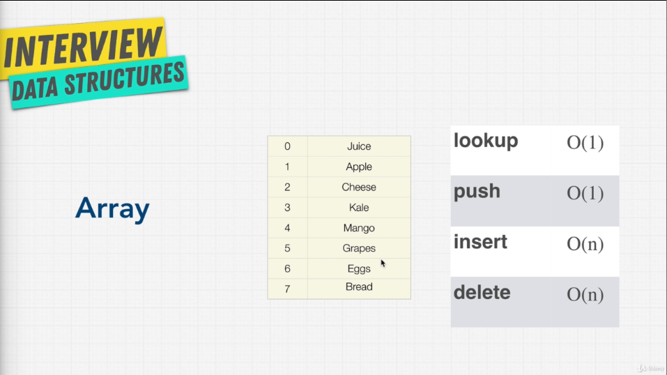

# Arrays Introduction



Arrays which are sometimes called lists organizes items sequentially in memory. They are the most simplest and most widely used DS.  

Lets demonstrate with code :- 

``` js
const strings = ['a','b','c','d'];
// 4 * 4 = 16 bytes of storage where one charecter takes 4 bytes

//so if we want to grab the third item (Accessing) in the array we will simply type
strings[2]; // which is 'c' remember array start with index 0
//Pushing to the end operation
strings.push('e'); //O(1)
//adds e at the last of the array
//Removing from the end operation
strings.pop(); // O(1)
strings.pop();
//removes e and d from the last
//Inserting at the start
strings.unshift('x'); //O(n)
//this big o is due to the fact that adding a item at the beginning means that we have to shift all the other items one index ahead.
//Same goes for removing from start using shift() and time complexity is O(n)

//How to add or delete an item from in between of the array in js
// we will use the .splice() method
strings.splice(2,0,'alien') //(where to start(start count), how many to delete(delete count), item to add) and TC is O(n/2) => O(n)
```
`Final result is : ['x','a','alien','b','c']`

And now you are able to understand the chart given at the start of operations and there time complexities.

## Static vs Dynamic Arrays

Here's a comparison of static and dynamic arrays with examples:

| Characteristic          | Static Arrays                                  | Dynamic Arrays                                |
|-------------------------|------------------------------------------------|-----------------------------------------------|
| **Size**                | Fixed size, specified at creation.             | Dynamic size, can grow or shrink as needed.  |
| **Memory Allocation**   | Memory allocated all at once.                 | Memory allocated in chunks.                  |
| **Efficiency**          | More memory-efficient, no wasted space.       | May be less memory-efficient due to resizing. |
| **Usage**               | Suitable when the number of elements is known and won't change. | Suitable when the number of elements is unknown or may change. |

**Example: Static Array**
```python
# Static array in Python with a fixed size of 5
static_array = [10, 20, 30, 40, 50]

# You can access elements by index:
element = static_array[2]  # Accessing the third element (30)

# Attempting to add more elements will result in an error:
# static_array.append(60)  # Error: 'list' object has no attribute 'append'
```

**Example: Dynamic Array**
```python
# Dynamic array in Python using a list
dynamic_array = []

# You can add elements, and the array will dynamically resize:
dynamic_array.append(10)
dynamic_array.append(20)
dynamic_array.append(30)

# Now the dynamic array contains [10, 20, 30]

# You can also remove elements:
dynamic_array.pop()  # Removes and returns the last element (30)

# Now the dynamic array contains [10, 20]

# You can continue adding elements as needed, and it will resize as necessary:
dynamic_array.append(40)
dynamic_array.append(50)
dynamic_array.append(60)

# Now the dynamic array contains [10, 20, 40, 50, 60]
```

In the dynamic array example, the array can grow as you add more elements, and it can shrink if you remove elements. This flexibility is not present in static arrays, which have a fixed size determined at the time of creation.

## .append() is O(1) but can be O(n)

In most programming languages, the `append()` operation for dynamic arrays (also known as dynamic arrays or ArrayLists in some languages) is typically amortized O(1), not O(n). This means that on average, adding an element to the end of a dynamic array takes constant time, but there may be occasional resizing operations that take longer but are infrequent.

Here's why `append()` is usually considered O(1) amortized:

1. **Array Doubling**: Dynamic arrays often allocate memory in chunks. When the current array is full, a new, larger array is allocated (usually twice the size of the old one), and the elements from the old array are copied to the new one. This is called an "array doubling" operation.

2. **Amortization**: Although copying the elements to the new array takes longer (O(n) time where n is the number of elements in the old array), this operation doesn't happen every time you use `append()`. It only occurs when the current array is full.

3. **Amortized Analysis**: To analyze the average time complexity of a series of `append()` operations, you consider the cost of the occasional array doubling operation along with the fast O(1) time for most `append()` operations. On average, over many `append()` operations, the cost of the occasional copying becomes insignificant, resulting in an average time complexity of O(1).

So, while there are situations where `append()` might take longer due to resizing, the amortized time complexity remains O(1), making dynamic arrays efficient for adding elements at the end.

## Implementing an Array

Let's understand how Arrays are built. Although you can simply make an array in a programming language here for example in JavaScript like
```js
const a = [];
```
but how they are actually built or there foundation is what we need to understand. And although interviewer will never ask this it's good to have a foundational knowledge and you will see how data stuctures are built upon other data structures.

We are building a Array from scarach in JS, and you must know that different languages implement this in different ways, but its still would be applicable to how they work in different languages.

```js
class MyArray {
    constructor() {
        this.length = 0;  // Initialize the length of the array to 0.
        this.data = {};  // Create an empty object to store the array elements.
    }

    get(index) {
        // Retrieve the value at a specific index.
        return this.data[index];
    }

    push(item) {
        // Add an item to the end of the array.
        // The item is stored at the current length index.
        this.data[this.length] = item;
        this.length++;  // Increment the length of the array.
        return this.length;  // Return the new length of the array.
    }

    pop() {
        // Remove and return the last item from the array.
        const lastItem = this.data[this.length - 1];
        delete this.data[this.length - 1];  // Delete the last item from the object.
        this.length--;  // Decrease the length of the array.
        return lastItem;  // Return the removed item.
    }

    delete(index) {
        // Remove and return an item at a specific index.
        const item = this.data[index];
        this.shiftItems(index);  // Call a helper function to shift items to fill the gap.
        return item;  // Return the removed item.
    }

    shiftItems(index) {
        // Helper function to shift items in the array to fill the gap left by deleted elements.
        for (let i = index; i < this.length - 1; i++) {
            this.data[i] = this.data[i + 1];  // Move each item one position to the left.
        }
        delete this.data[this.length - 1];  // Delete the duplicate last item.
        this.length--;  // Decrease the length of the array.
    }
}

```

This can be tested with

```js
const newArray = new MyArray();
newArray.push('hi');
newArray.push('you');
newArray.push('!');
newArray.pop();
newArray.delete(0);
newArray.delete(1);
console.log(newArray);
```

This code defines a simple JavaScript class called MyArray. This class emulates some basic functionality of an array.

Here's what each method does:

- `constructor()`: Initializes an empty array-like object with a length property set to 0 and an empty data object to store the elements.

- `get(index)`: Retrieves the value at a specified index in the array.

- `push(item)`: Adds an item to the end of the array, similar to the push() method in JavaScript arrays.

- `pop()`: Removes and returns the last item in the array, similar to the pop() method in JavaScript arrays.

- `delete(index)`: Removes and returns an item at a specified index in the array and fills the gap left by the deleted item by shifting the subsequent items one position to the left.

This `MyArray` class is a simplified example of how arrays work internally in many programming languages. It's a good way for beginners to understand the basic mechanics of arrays and how they can be implemented.

## Strings and Arrays

Just a side note :

> In interview you should treat any string questions like an array question as stings are just a charecters array.

### Exercise : Reverse a string.

```js
//Create a function that reverses a string:
//'Hi My name is Sooraj' should be:
//'jarooS si eman yM iH'
```

**Method 1:**
```javascript
function reverse(str) {
    // Check input
    if (!str || str.length < 2 || typeof str !== 'string') {
        return "That's not a String";
    }

    const backwards = []; // Create an empty array to store reversed characters.
    const totalItems = str.length - 1;

    // Iterate through the input string from the end to the beginning.
    for (let i = totalItems; i >= 0; i--) {
        backwards.push(str[i]); // Add characters to the 'backwards' array in reverse order.
    }

    return backwards.join(''); // Join the characters in the 'backwards' array to form the reversed string.
}
```

**Method 2:**
```javascript
function reverse2(str) {
    return str.split('').reverse().join('');
    // 1. Split the string into an array of characters.
    // 2. Reverse the order of the characters in the array.
    // 3. Join the characters in the array back together to form the reversed string.
}
```

**Method 3:**
```javascript
const reverse3 = str => [...str].reverse().join('');
// 1. Using the spread operator, convert the string into an array of characters.
// 2. Reverse the order of the characters in the array.
// 3. Join the characters in the array back together to form the reversed string.
```

All three methods essentially perform the same task of reversing a string, but they use different techniques to achieve it. Methods 2 and 3 are more concise and use built-in JavaScript functions to simplify the process, while Method 1 provides a more explicit step-by-step approach. Here's how you would use these functions:

```javascript
console.log(reverse('Hi My name is Sooraj')); // Outputs: "jarooS si eman yM iH"
console.log(reverse2('Hi My name is Sooraj')); // Outputs: "jarooS si eman yM iH"
console.log(reverse3('Hi My name is Sooraj')); // Outputs: "jarooS si eman yM iH"
```

All three methods should produce the same reversed output for the input string "Hi My name is Sooraj."


### Exercise : Merge sorted arrays.

```javascript
//You are given different sorted arrays you need to merge them into one merged sorted array
mergeSortedArrays([0,3,4,31],[4,6,30]);
//[0,3,4,4,6,30,31]
```

This code defines a function called `mergeSortedArrays` that takes two sorted arrays (`array1` and `array2`) and merges them into a single sorted array. Here's an explanation of how the code works:

```javascript
function mergeSortedArrays(array1, array2) {
    const mergedArray = []; // Create an empty array to store the merged result.
    let array1Item = array1[0]; // Initialize a variable to track the current element from array1.
    let array2Item = array2[0]; // Initialize a variable to track the current element from array2.
    let i = 1; // Initialize an index variable for array1 starting at the second element.
    let j = 1; // Initialize an index variable for array2 starting at the second element.

    // Check for empty arrays and handle them separately.
    if (array1.length === 0) {
        return array2;
    }
    if (array2.length === 0) {
        return array1;
    }

    // Compare elements from both arrays and add the smaller element to the mergedArray.
    while (array1Item || array2Item) {
        console.log(array1Item, array2Item) //Gives a clear understanding of what is been compared
        if (!array2Item || array1Item < array2Item) {
            mergedArray.push(array1Item); // Add array1Item to the mergedArray.
            array1Item = array1[i]; // Move to the next element in array1.
            i++;
        } else {
            mergedArray.push(array2Item); // Add array2Item to the mergedArray.
            array2Item = array2[j]; // Move to the next element in array2.
            j++;
        }
    }

    return mergedArray; // Return the merged and sorted array.
}

// Example usage:
const result = mergeSortedArrays([0, 3, 4, 31], [4, 6, 30]);
console.log(result); // Outputs: [0, 3, 4, 4, 6, 30, 31]
```

Here's a step-by-step explanation of how the function works:

1. It initializes variables to track the current elements in `array1` and `array2` (starting with the first elements) and index variables (`i` and `j`) to move through the arrays.

2. It checks for special cases where one of the input arrays is empty and returns the other array if that's the case.

3. The main loop compares the current elements from both arrays (`array1Item` and `array2Item`) and adds the smaller one to the `mergedArray`.

4. The loop continues until both `array1Item` and `array2Item` become `undefined`, indicating that all elements from both arrays have been processed.

5. Finally, the merged and sorted array is returned as the result.

In the example usage at the end, it shows how you can use the `mergeSortedArrays` function to merge two sorted arrays, producing a single sorted array as the result.

The line `if (!array2Item || array1Item < array2Item)` is a conditional statement within the `while` loop of the `mergeSortedArrays` function. Let's break it down:

1. `array2Item` and `array1Item` are variables that represent the current elements being compared from `array2` and `array1`, respectively. These elements are compared to determine which one is smaller.

2. `||` is the logical OR operator, which means "or." In this context, it's used to combine two conditions.

3. `!array2Item` checks if `array2Item` is falsy. In JavaScript, a variable is considered falsy if it's `undefined`, `null`, `0`, `false`, `NaN`, or an empty string. So, `!array2Item` checks if `array2Item` is either `undefined` or falsy.

4. `array1Item < array2Item` compares the values of `array1Item` and `array2Item`. It checks if `array1Item` is less than `array2Item`.

Now, let's understand the entire line step by step:

- If `array2Item` is `undefined` (which means there are no more elements in `array2` to compare), or if `array1Item` is less than `array2Item`, then the condition is `true`.

- If either of these conditions is `true`, it means that the smaller element among the two is in `array1`, so `array1Item` is added to the `mergedArray`.

- If neither of these conditions is `true`, it means that the smaller element is in `array2`, so `array2Item` is added to the `mergedArray`.

In summary, this line is responsible for comparing the current elements from `array1` and `array2` and determining which one should be added to the `mergedArray` next. It ensures that the elements are merged in ascending order, which is essential for merging sorted arrays correctly.

## Pros and Cons of Arrays

Pros are : 
- fast lookups
- fast push/pop
- Ordered

Cons are:
- slow inserts
- slow deletes
- Fixed size (if using static array)

-----------------------------------------