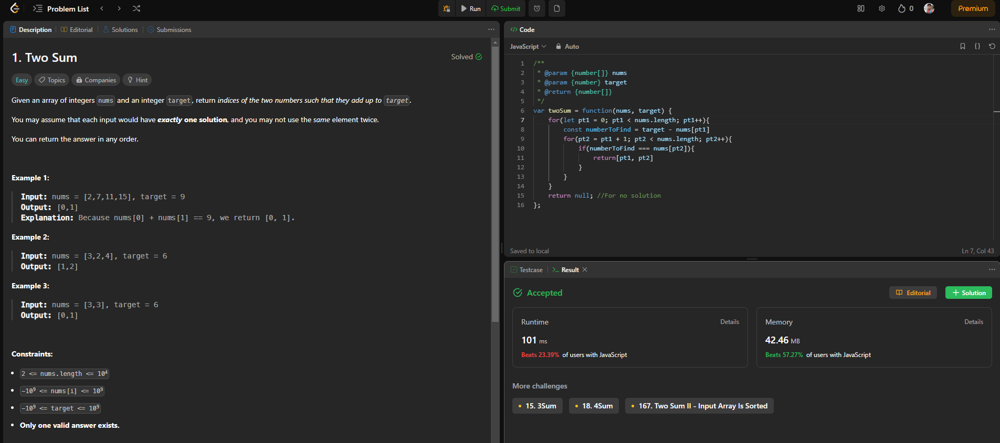
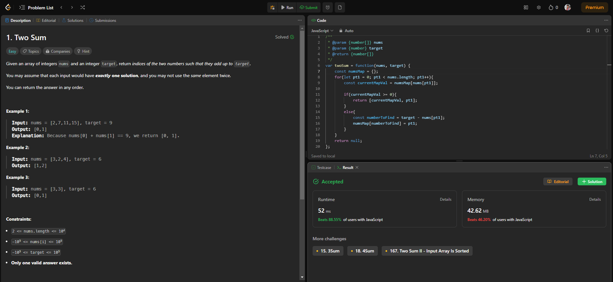

#  Arrays : Question #1 - Google Interview Question Two Sum (Easy)

You can check out the Question on LeetCode here  [Leetcode Two Sum](https://leetcode.com/problems/two-sum/) before going throught the solution.

The process shown in this lecture to solve the given problem is almost the same as Google wants there candidate to solve a given coding problem during interview. Here is the YouTube link to prove this point [Two Sum By Google](https://youtu.be/XKu_SEDAykw?si=aTme2dBumnh4FihE).

## Problem Statement

Given an array of integers `nums` and an integer `target`, return _indices of the two numbers such that they add up to `target`_.

You may assume that each input would have **_exactly one solution_**, and you may not use the _same_ element twice.

You can return the answer in any order.

 <br>

**Example 1:**

**Input**: nums = [2,7,11,15], target = 9 <br>
**Output**: [0,1] <br>
**Explanation**: Because nums[0] + nums[1] == 9, we return [0, 1].

**Example 2:**

**Input**: nums = [3,2,4], target = 6 <br>
**Output**: [1,2]

**Example 3:**

**Input**: nums = [3,3], target = 6 <br>
**Output**: [0,1]
 

**Constraints:**

- `2 <= nums.length <= 104`
- `-109 <= nums[i] <= 109`
- `-109 <= target <= 109`
- **Only one valid answer exists.**

**Follow-up**: Can you come up with an algorithm that is less than O(n2) time complexity?

<br>
---------------------------------------

## Process To Solve The Interview Problem.

Most of us would jump right into the problem after reading the problem statement but that's now how big companies like **Google** expect there candidates to do instead we are going to understand the correct approch to solve a problem and this problem is the exact problem Google has posted on there YouTube channel to demonstrate how they wants there candidates to solve any DSA problem. 

<br>

### Step 1: Verify The Constraints

What are constraints anyways?

> Constraints are ways we can understand the question better so that, you know what kind of edge cases you need to consider, as well as all of the different variables that might impact how you solve the given question. 

If constraints are not provided with the question then it would be a good practice to first ask them to your interviewer.

Let's assume that the constaints are not given for this question then what are the things you should ask for this particular question, lets see them one by one.

1. **Q : Are all the numbers positive or can there be negatives?** 
> Ans : Yes, there can be negatives `-109 <= nums[i] <= 109`
2. **Q: Are there duplicate numbers in the array?**
> Ans : Yes there can be.**
3. **Q : Will there always be a solution avaiable?**
> Ans : No, there may not always be a solution
> **Explaination** : Suppose our array is [1,3,5,4,6] and target = 25 or if our array is empty [] or has a single value [5] in these cases no vaild answer is produce.
4. **Q : What do we return if there's no solution?**
> Ans : Just return null. 
5. **Q : Can there be multiple pairs that add up to the target?**
> Ans : No, **Only one valid answer exists.**

<br>

### Step 2: Write Out Some Testcases

Suppose we are not given with the test cases then we can ask our interviewer, is it ok if we come up with some test cases together that best captures these different questions that you've helped me answer for constraints (_The test cases are already given for this question so we won't worry about that now_).

<br>

### Step 3: Figure Out A Solution Without Code

This is were you think about the problem from a logical prespective rather than in terms of loop, variables etc. Imagine you have been asked this question out of blue in real life then how would you tackle this from a logical POV. Can you come up with a working solution then that works with all the testcases?

Suppose we are given an array
> nums = [1,3,7,9,2] 

With a traget to find which is
> target = 11

The most quick solution comes up in our mind which is also our **Brute Force solution** would be to take one number at a time and then subtract the target with that number and check if the result is present in the rest of the numbers if not then we will cross out the first number and take the second number which again will be subtracted from target and the remaining numbers will be checked if it matches the result and we will continue this process until we find our match.

Therefore,
> nums = [1,3,7,9,2] <br>
 pt1 => nums[0] = 1 <br>
 numberToFind = target - pt1 <br>
 pt2 => num[1] = 3 <br>
 if pt2 != numberToFind <br>
 pt2++
 else pt2 is the answer <br>
 if array ends the pr1++ => pt1 = nums[1] <br>
 And repeat the process for pr2 from num[2]

Let's implement this solution in code on next step.

<br>

### Step 4: Writing Our Brute Force Solution In Code

Let's write our Brute Force Solution in JavaScript :-

```javascript
const findTwoSum = function(nums, target){
    for(let pt1 = 0; pt1 < nums.length; pt1++){
        const numberToFind = target - nums[pt1]
        for(pt2 = pt1 + 1; pt2 < nums.length; pt2++){
            if(numberToFind === nums[pt2]){
                return[pt1, pt2]
            }
        }
    }
    return null; //For no solution
}
```
<br>

### Step 5: Double Check For Errors

Just look at your code carefully to check if you have not made any syntax error or by mistake have not wriiten the name of the variable incorrect some place or the other because not all interviews are held on IDEs some are pen paper based as well so you must have a good habit of double checking.

<br>

### Step 6: Test The Code Using An Testcase And See Weather You Understand Your Code.

It is important to understand you should not try to memorize the code and to make your interviewer believe that you don't you can put a test case into action on your code without actually putting it into the editor first. Just visualize whats happening on each line of the code and demonstrate how your code is flowing line by line ofcourse if you have time.

## Let's Check The Solution On Leetcode



Although the runtime and memory might be different for you it's still the fact that our time complexity is high and that we need to optimize our code for a better time and space complexity.

<br>

### Step 7: Space & Time Complexity

Let's know try to figure out how much space and time resources our code will consume based on the size of our inputs.

In the code above let's observer whats really happening

> The memory of the program really depends on the size of the given array which is nums[].

#### What will be the Time-Complexity?

As we have previously learnt in our BIG-O chapter we can see here that the fisrt for loop has a Big O of n that is O(n). Inside we have another for loop that is nested inside the first and due to this these two will probably run at O(n^2). So is that the case well when you look at the second for loop there are instances where it's going to touch the majority of all of the elements inside the array so let's just say that it runs at O(n) times.So this means we are running n iterations for every iterations in the first for loop so it become n*n which is **O(n^2)**.
And this might not always be the case but we are trying to find out the relative relationship to the size of input as it grows. And this relation is a *Quadractic* one.

On the other hand our Space complexity is O(n) as the only real space taking stuff is the array itself the rest pt1 and pt2 are pretty much the single integers. And this space complexity is as optimal as it can get.

(Which complexity is good and which is bad is given in the chart of BIG-O Chapter go check out.)

<br>

### Step 8: Can We Optimize Our Solution?

So we already know that out space complexity is O(1) which is the best space complexity as it can get where on the other hand the Time complexity which is O(n^2) is not so good and this is a hint that we can optimize our code by using more resourse in one that is much better in order to bring down the other complexity in our case the time using resources of space.

We will use some type of data structure which consume more space in return of faster runtime and in order to bring down time we need to analyze what's consuming up this time complexity in our.

For us the more time is due to these 2 for loops so we need to find a way to either remove one or even potentially combine them together. And this is a good hint, you wanna figure out if there's a way that you can merge your two or multiple different pieces of code that are taking up multiple iterations.

Now let's see what the first for loop is doing well we see that it is assigning a pointer pt1 and using that pointer it's calculating it's opposing pair value to find by substracting it to the target.

> Calculate numberToFind

What does the second for loop do? well it's just compare that value through iteration and this is just too much time consuming.

> nums[pt2] === numberToFind

And there we find our problem which is that we are not storing what already have been calculated and so we had to go though each iteration again and again and to solve this we are going to use a **Hash Map** so we not need to do all these additional checks and we could just store it some where. And why Hash Map well that's because the LookUp of Hash Map is O(1) as long as we have the key. And we are going to set the key equal to the number that we have to find.

Now let's explain you the logic : 
nums = [1,3,7,9,2], t =11

1. Set pt1 = nums[0] = 1
2. calculate nTF using nTF = target - pt1 => 10
3. store the nTF value into our hashmap as value with a key of 0 {10 : 0}
4. put pt1 on nums[1] and check if this number matches any key in our hashmap and here the only key present is 10 and 3 != 10 so 
5. find the nTF using nums[1] => 3 which is equal to 8 and store that in hasmap as {10: 0, 8: 1} with key as 1
6. Repeat this process
7. from the testcase above you have to find the nTF till nums[3] which is 9 and your hashmap will look like this {10: 0, 8: 1, 4: 2, 2: 3}
8. Once your pt1 is = nums[4] which is 2 and you will check the hashmap you will find the a key which is 2 is present in your hashmap and it's value is 3 same as the index of 9 or nums[3]
9. and so your final answer would be [the value of the hashmap key which was equal to the nTF, index of pt1]

And this way we successfully removed the second for loop by storing the value of nTF in a hashmap.

<br>

### Step 9: Writing Our Optimal Solution In Code

Let's write our Optimal Solution in JavaScript :-

```javascript
// Define a function called findTwoSum that takes two parameters: nums (an array) and target (a target sum).
const findTwoSum = function(nums, target) {
    // Create an empty object called numsMap. This object will store numbers as keys and their corresponding indices as values.
    const numsMap = {};

    // Start a loop that iterates through the elements of the nums array using pt1 as the loop counter.
    for (let pt1 = 0; pt1 < nums.length; pt1++) {
        // Get the value (index) associated with the current element (nums[pt1]) from the numsMap.
        const currentMapVal = numsMap[nums[pt1]];

        // Check if currentMapVal is greater than or equal to 0 (indicating that a complementary number has been found).
        if (currentMapVal >= 0) {
            // If so, return an array containing the currentMapVal (index of the complementary number) and pt1 (current index).
            return [currentMapVal, pt1];
        } else {
            // Calculate the number that needs to be found in order to reach the target sum.
            const numberToFind = target - nums[pt1];

            // Store the current index (pt1) in the numsMap object using numberToFind as the key.
            // This will help us remember that we've seen the current number and are looking for its complement.
            numsMap[numberToFind] = pt1;
        }
    }

    // If no two numbers in the array add up to the target sum, return null (indicating that no solution was found).
    return null;
}

```

After double checking for any errors we need to run some testcases ourself too see if our solution is correct.

Lets try it out here, with nums = [1,3,7,9,2] and target = 11 :

1. `pt1 = 0` this is where our loop will start
2. `cMV = numsMap[nums[pt1]] = numsMap[nums[0]] = numsMap[1]` what we are trying here to get is the value for the Key which is 1 but since our HashMap is empty right now therefore `cMV = undefined`
3. since cMP is undefined it is not >= 0 so we will move to the else block
4. here we evaluate nTF and then we set that as a key in our hashmap with a value of pt1 which is currently 0 by this line ` numsMap[numberToFind] = pt1`
5. This process will continue and as we find `nTF = 2` when `pt1 = 3` then we set numsMap[2] = 3;
6. `cMV = numsMap[nums[4]]=numsMap[2]` and here the value of `cMV = 3` because now 2 exist in our HashMap and finally
7. cMV which is equal to 2 is greater than 0 and we get [cTV,pt1] = [3,4] as our result.

**Now taking a look at Time & Space**

Since we have only one for loop and it loops over every element in the worst case therefore we can safely say our Big O or our Time Complexity is **O(n)**

For space we can see that we calculate the key value pair for every element to check weather the pair is present or not and for reason our space complexity scales at **O(n)** as well in worst case.

## Let's Check The Solution On Leetcode



Always look for the Space and Time complexity and not the numbers you get after submitting your code on leetcode because that keep on changing. Looking at Big O is the best way to compare your solution with others.

--------------------------------------

In an interview you need to be vocal about the steps you take to solve a coding problem and these steps are the best practice one could do to make themself much more of a critical thinker and this is what big companies like Google wants from there employies.

---------------------------------------


