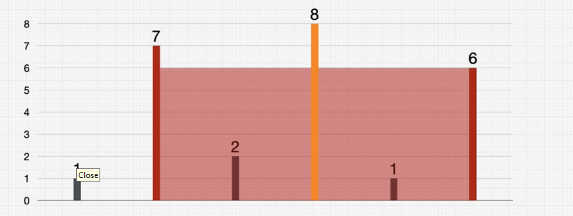
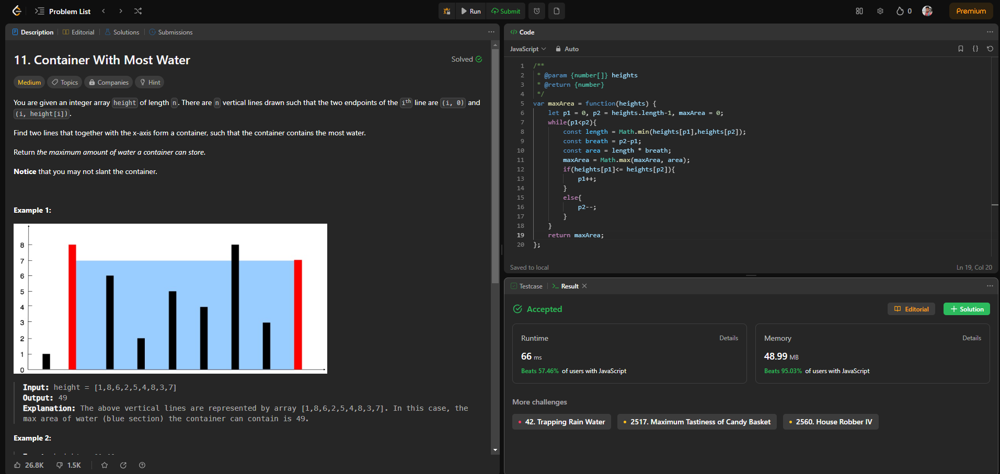

# Interview Question #2 - Container With Most Water

You can check out the Question on LeetCode here  [Leetcode Container With Most Water](https://leetcode.com/problems/container-with-most-water/) before going throught the solution.

## Problem Statement

You are given an integer array `height` of length `n`. There are `n` vertical lines drawn such that the two endpoints of the **i<sup>th</sup>** line are `(i, 0)` and `(i, height[i])`.

Find two lines that together with the x-axis form a container, such that the container contains the most water.

Return *the maximum amount of water a container can store*.

**Notice** that you may not slant the container.

 <br>

**Example 1:**


**Input**: height = [1,8,6,2,5,4,8,3,7] <br>
**Output**: 49 <br>
**Explanation**: The above vertical lines are represented by array [1,8,6,2,5,4,8,3,7]. In this case, the max area of water (blue section) the container can contain is 49. <br>


**Example 2:**

**Input**: height = [1,1] <br>
**Output**: 1 <br>
 
    
Constraints:

- n == height.length
- 2 <= n <= 10<sup>5</sup>
- 0 <= height[i] <= 10<sup>4</sup>  

--------------------------------------

## Process To Solve The Interview Problem.

### Step 1: Verify The Constraints

1. **Q : Does the thickness of the lines affect the area?** 
> Ans : No, assume they take up no space.
2. **Q : Do the left and right side of the graph counts as walls** 
> Ans : No, the sides connot be used to form a container that is container can only be formed using the values inside the array.
3. **Q : Does a higher line inside our container affect our area?** 
> Ans : No, lines inside a container don't affect the area.



<br>

### Step 2: Write Out Some Testcases

Lets first think of the best testcase that could be something like:

**Testcase 1**
> [7,1,2,3,9]

Because we know that the length of 7 and 9 are the greatest and so is the distance or gap between them. So if we make a container using 7 and 9 then it length would be 7 because `7 < 9` and if the water goes above 7 then it will spill out of the container.

And the distance between 7 and 9 would be `4 - 0 = 4` where 0 is the index of 7 and 4 is the index of 9.

So, the area is `Length X Breath` which is equal to `7 X 4` here.

Another 2 testcases can be with array has no value or only one value:

**Testcase 2**
> [] , [1]

In that case the area would simply be 0

Now there can be another case where the largest number doesn't matter:

**Testcase 3**
> [1,7,2,8,1,6]

And you can see why from the diagram given above in constraints section. The largest area here is not `7x2` where 2 is the distance between 7 and 8, but `6x4` where 4 is the distance between 7 and 6.

<br>

### Step 3: Thinking Through A Logical Brute Force Solution

If we think properly we can see that it's a Max value question and here we see to look at all the possible containers that can be formed from the given elements of the array to find the one with max area.

Remember this is a brute force solution so we are not thinking of time complexity for now all we want is a logical working solution for now.

So to calculate all the possible area that can be made from the elements of the array let's again take two pointers let them be `p1` and `p2` this time and a variable of `maxArea` with the innitial value of 0.

Now let,
> array = [7,1,4,6,9] <br>
we will innitially keep a = 7 and b = 1 <br>
we know that area = lxb and the hight of the container is the lesser number between the two numbers, therefore <br>
area = min(a,b) x (b<sub>i</sub>-a<sub>i</sub>), where b<sub>i</sub> and a<sub>i</sub> are the indexes. <br>
The value of maxArea keep changing if it encounter a value greater than the previously store value.<br>
The pointer p2 progress one by one and when it covers the whole array then the pointer p1 moves to the next index and p2 starts again from the index next of the index which a is pointing too. <br>
And this way we find the maxArea.

<br>

### Step 4: Writing Our Brute Force Solution In Code

Lets take our array which is heights = [7,1,2,3,9] and we know the formula which is area = min(a,b) x (b<sub>i</sub>-a<sub>i</sub>)

So now lets code the solution in JavaScript:

```javascript 
const getMaxContainer = function(heights){
    let maxArea = 0;
    for(let p1 = 0; p1 < heights.length; p1++){
        for(let p2 = p1 + 1; p2 < heights.length; p2++){
            const length = Math.min(heights[p1], heights[p2]);
            const breath = p2 - p1;
            const area = length * breath;
            maxArea = Math.max(maxArea, area);
        }
    }
    return maxArea;
}
```

Now are giving it a double check we can go over one testcase for this solution and i'm sure you can do that by your own no need for me to show you step by step.

Let's put this on leetcode and see what we get.

## Let's Check The Solution On Leetcode


As you can see we get a **time limit exceeded warning** and this is mainly due to the fact that our code has a time complexity of **O(n<sup>2</sup>)** on the other hand our space complexity has no much effect of variables like length, breath, area and maxArea so we can say it's **O(1)**.

<br>

### Step 5: Can We Optimize Our Solution?

So let's think rationally about this problem, can we go for the same approch as question 1 Two Sum?

- In the 1st question we where thinking of using our space resource to decrease our time. But is it going to help us here?
- What we are doing? We are storing the max area that we've come across so far of each area that we calculated using p1 and p2. 
- We need these two pointers and the two for loop which means that there's actually no additional caching that can happen for p1. So can we eleminate the second for loop?
- we calculate the Length and the Breath using these 2 pointers and then we get the area then we essentially just check against the match we got so far and we see if we need to update it. And inside as we are not storing anything uselesly.

So no what we did in Two Sum is not gonna work here.

So we are going to use a new technique to solve this problem.

## Shifting Pointers

The Container With Most Water problem can be solved effectively using the Shifting Pointers technique. Here's a step-by-step explanation in bullet points on how to use this technique for this problem:

1. **Initialization:**
   - Initialize two pointers, `left` and `right`, at the two ends of the array.
   - Initialize a variable, `maxArea`, to store the maximum container area found so far. Initialize it to 0.

2. **Looping:**
   - Start a loop while the `left` pointer is less than the `right` pointer. This ensures that we explore all possible container configurations.

3. **Calculate Current Area:**
   - Calculate the container's area formed by the two pointers: `min(height[left], height[right]) * (right - left)`.
   - Update `maxArea` by taking the maximum of the current `maxArea` and the newly calculated area.

4. **Shifting Pointers:**
   - Compare the heights of the bars pointed to by `left` and `right`.
   - Move the pointer pointing to the shorter bar inward because moving the taller bar inward wouldn't improve the area (the width would decrease, and the height would stay the same or decrease).
   - Increment `left` if `height[left]` is smaller or decrement `right` if `height[right]` is smaller.

5. **Repeat:**
   - Continue the loop until the `left` pointer is no longer less than the `right` pointer.

6. **Return Result:**
   - Once the loop ends, return the `maxArea` as the maximum water container area.

This approach efficiently finds the maximum container area by systematically exploring all possible container configurations and updating the `maxArea` while shifting pointers. The time complexity is O(n), where n is the number of elements in the `height` array, making it an optimal solution for this problem.

<br>

### Step 6: Writing Our Optimal Solution In Code

Let's write our Optimal Solution in JavaScript :-

```javascript
const getMaxWaterContainer = function(heights) {
    let p1 = 0, p2 = heights.length - 1, maxArea = 0;
    
    // Initialize two pointers, 'p1' and 'p2', at the beginning and end of the 'heights' array.
    // Initialize 'maxArea' to keep track of the maximum container area found.

    while (p1 < p2) {
        // Calculate the length (height of the shorter vertical line) and width (distance between pointers).
        const length = Math.min(heights[p1], heights[p2]);
        const width = p2 - p1;

        // Calculate the area of the container formed by 'p1' and 'p2'.
        const area = length * width;

        // Update 'maxArea' with the maximum of the current area and 'maxArea'.
        maxArea = Math.max(maxArea, area);

        // Move the pointer pointing to the shorter vertical line inward.
        if (heights[p1] <= heights[p2]) {
            p1++;
        } else {
            p2--;
        }
    }

    // Return the maximum container area found.
    return maxArea;
}
```
After double checking for errors we can run a testcase and here is the explaination of how the process is going on inside.

**Explanation:**

- The code initializes two pointers, `p1` and `p2`, at the beginning and end of the `heights` array, respectively. It also initializes `maxArea` to 0 to keep track of the maximum container area found.

- Inside the `while` loop, the code calculates the length of the container (the height of the shorter vertical line) and the width of the container (the distance between the pointers).

- It calculates the area of the container as the product of the length and width and updates `maxArea` with the maximum of the current area and the previously recorded maximum.

- The code then moves one of the pointers inward. If the height at `p1` is less than or equal to the height at `p2`, `p1` is incremented to potentially find a taller line. Otherwise, `p2` is decremented to potentially find a taller line on the right side.

- The loop continues until `p1` is no longer less than `p2`, ensuring that all possible container configurations have been explored.

- Finally, the maximum container area found (stored in `maxArea`) is returned as the result.

**Time Complexity:** O(n)
- The code iterates through the `heights` array once with two pointers (`p1` and `p2`), where `n` is the number of elements in the array.
- Since the loop runs in linear time, the time complexity is O(n).

**Space Complexity:** O(1)
- The code uses a constant amount of additional space, regardless of the size of the input array. It only requires a few variables (`p1`, `p2`, `maxArea`, `length`, `width`, and `area`), and the space complexity is therefore O(1), indicating constant space complexity.

This code efficiently solves the problem with a time complexity of O(n) and minimal space requirements. It leverages the Shifting Pointers technique to find the maximum water container area in an optimal manner.

## Let's Check The Solution On Leetcode



#### And this is how we solve the **Container with most water problem**.

--------------------------------------