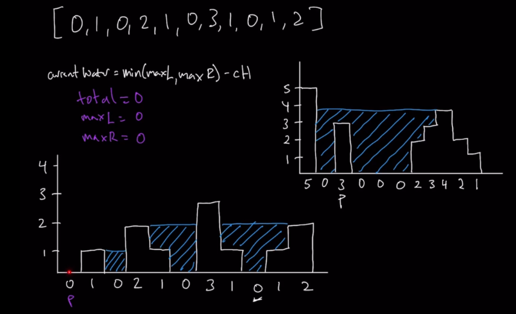
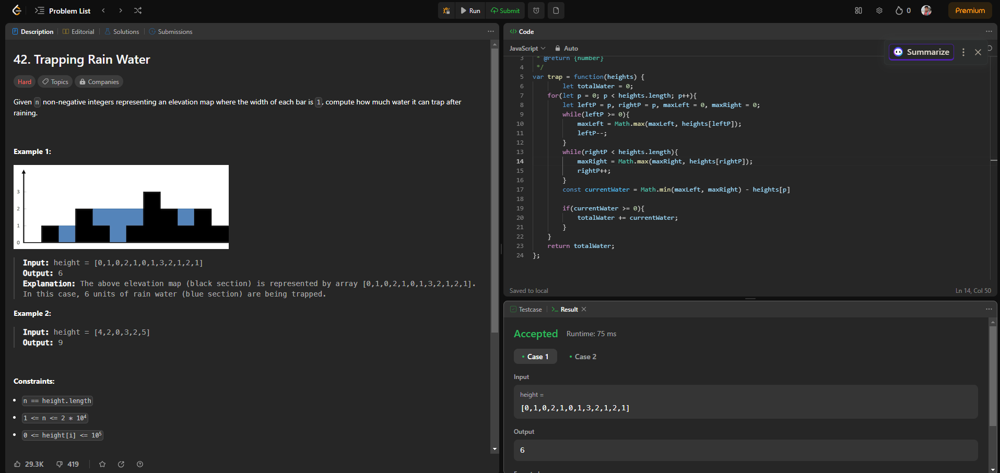
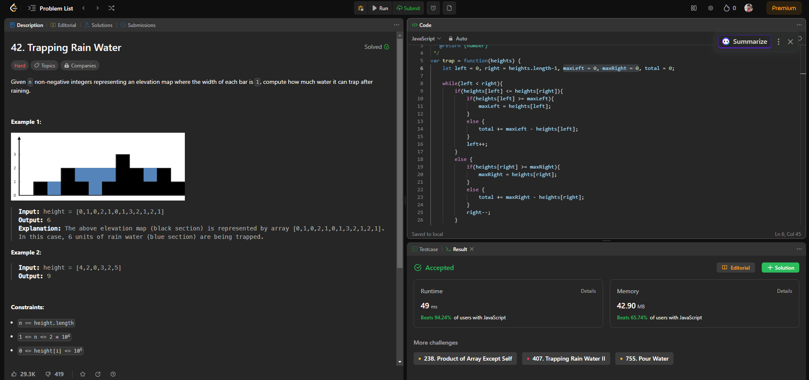

# Arrays : Questions #3 - Trapping Rainwater (Hard)

You can check out the Question on LeetCode here  [Leetcode Trapping Rainwater](https://leetcode.com/problems/trapping-rain-water/description/) before going throught the solution.

## Problem Statement

Given `n` non-negative integers representing an elevation map where the width of each bar is `1`, compute how much water it can trap after raining.

<br>

**Example 1:**


**Input**: height = [0,1,0,2,1,0,1,3,2,1,2,1] <br>
**Output**: 6 <br>
**Explanation**: The above elevation map (black section) is represented by array [0,1,0,2,1,0,1,3,2,1,2,1]. In this case, 6 units of rain water (blue section) are being trapped. 

**Example 2:**

**Input**: height = [4,2,0,3,2,5]
**Output**: 9
 

**Constraints:**

- n == height.length
- 1 <= n <= 2 * 10<sup>4</sup>
- 0 <= height[i] <= 10<sup>5</sup>

-----------------------------------------------

## Process To Solve The Interview Problem.

### Step 1: Verify The Constraints

1. **Q : Do the left and right side of the graph counts as walls** 
> Ans : No, the sides connot be used to form a container that is container can only be formed using the values inside the array.

<br>

### Step 2: Write Out Some Testcases

1. **Best case**
> height = [0,1,0,2,1,0,1,3,2,1,2,1] <br>
Output : 6

2. **No answer case**
> height = [] or [2] <br>
Output : 0

3. **The Hill case**
> height = [0,3,4,3,0] <br>
Output : 0

<br>

### Step 3: Figure Out A Solution Without Code



We need to think this in terms of blocks.

The formula here which is,
> `currentWater = min(maxL,maxR) - currentPointer`

It is a simple but a logical solution to think of. We have a pointer which goes both left and right from it's current position just to find a max value on both left and right side (`maxL` & `maxR`) of the container as it may form the container.

If we look at the `0` on index 2 of the given array above. We will notice that the Max value at the left side is `1` on index 1 and max value at right is `3`on index 6. Now to calculate the water on index 2 we just need to find the min between values `(1,3)` which is `1` and subtract it with value on which the water need to be calculated which is `0` on index 2 and the water is `(1-0)` equal to `1` which will then be add up to the total and the current pointer will then move forward and same process will then continue again.

Well what about when the currentWater result is `0` or in `negative`. In that case **it will not be added to the total**.

<br>

### Step 4: Writing Our Brute Force Solution In Code

Let's write our Brute Force Solution in JavaScript :-

``` javascript
const getTrappedRainwater = function(heights){
    let totalWater = 0;
    for(let p = 0; p < heights.length; p++){
        let leftP = p, rightP = p, maxLeft = 0, maxRight = 0;
        while(leftP >= 0){
            maxLeft = Math.max(maxLeft, heights[leftP]);
            leftP--;
        }
        while(rightP < heights.length){
            maxRight = Math.max(maxRight, heights[rightP]);
            rightP++;
        }
        const currentWater = Math.min(maxLeft, maxRight) - heights[p]

        if(currentWater >= 0){
            totalWater += currentWater;
        }
    }
    return totalWater;
}
```

We will check for syntax error and run a test case to check if our code is correct or not.

### Space & Time Complexity

**Time Complexity:** O(n^2)
- The code uses two nested loops: one loop iterates through the `heights` array using the `p` pointer, and the other two loops (inside the outer loop) search for the maximum heights to the left and right of the current position `p`.
- In the worst case, both inner loops can each iterate through nearly the entire array (up to `n` elements) when there are ascending or descending heights.
- Therefore, the overall time complexity is O(n^2), where `n` is the number of elements in the `heights` array.

**Space Complexity:** O(1)
- The code uses a constant amount of additional space, regardless of the size of the input array. It only requires a few variables (`totalWater`, `p`, `leftP`, `rightP`, `maxLeft`, `maxRight`, and `currentWater`), and the space complexity is therefore O(1), indicating constant space complexity.

## Let's Check The Solution On Leetcode



It is accepted but when we try to submit this code we get the same warning message of **time limit exceeded** as we have expected.

<br>

### Step 5: Can We Optimize Our Solution?

Let's explain the logic behind calculating trapped rainwater using a real-life example with simple words.

Imagine you have a row of containers, and each container can hold some amount of water. These containers are represented by a series of bars of different heights, where the height of each bar indicates how much water it can trap. Your goal is to find out how much water these containers can trap when it rains.

Here's how you would approach this:

1. **Start at the Sides:**
   - You stand at one end of the row of containers (the left end), and your friend stands at the other end (the right end).
   - You both have empty buckets to collect rainwater.

2. **Look at the Tallest Bar:**
   - You start by looking at the bar in front of you (the leftmost bar), and your friend looks at the bar in front of them (the rightmost bar).
   - You both note down the height of these bars.

3. **Compare Heights:**
   - Now, you and your friend compare the heights of the bars you're looking at. You want to see which bar is shorter.
   - If your bar is shorter than or equal to your friend's bar, you decide to process your side first. If your friend's bar is shorter, they will process their side first.

4. **Processing Your Side:**
   - Since you decided to process your side, you check if your bar is taller than the tallest bar you've seen so far on your side. If it is, you update your record of the tallest bar.
   - Then, you check how much water can be trapped between your bar and the tallest bar you've seen. This trapped water is calculated by finding the difference in height between your bar and the tallest bar.
   - You add this trapped water to your bucket.

5. **Moving Toward the Center:**
   - After processing your side, you take a step to the right (closer to the center), and your friend takes a step to the left.
   - You both repeat the process: comparing heights, updating the tallest bar, and calculating trapped water.

6. **Meeting in the Middle:**
   - You and your friend keep moving toward the center, processing bars one by one, until you both meet in the middle.
   - This ensures that you've considered all the bars in the row.

7. **Total Trapped Water:**
   - Finally, you and your friend pour the water you've collected in your buckets into a single container and measure how much water you've trapped. This is the total trapped rainwater.

8. **Return the Result:**
   - You share this total trapped water amount as the result of your calculation.

In this real-life example, you and your friend act as the left and right pointers, the bars represent the heights of the containers, and the calculation of trapped water is similar to the code's logic. By moving from both ends toward the center and comparing heights, you efficiently find the total trapped rainwater without needing to simulate actual rain. This is precisely how the code logic works, using two pointers to calculate the trapped rainwater between the bars.

Let's break down the logic behind the code for calculating trapped rainwater point by point:

1. **Initialization:**
   - Initialize two pointers, `left` and `right`, at the beginning and end of the `heights` array, respectively. These pointers will help us iterate through the array while considering potential trapped water.
   - Initialize `maxLeft` and `maxRight` to 0. These variables will keep track of the maximum heights encountered on the left and right sides of the pointers.
   - Initialize `total` to 0. This variable will accumulate the total trapped rainwater.

2. **Main Loop:**
   - Enter a `while` loop that continues as long as `left` is less than `right`. This loop ensures that we explore all elements in the array, moving towards the center.

3. **Comparing Heights:**
   - Inside the loop, compare the heights at the `left` and `right` pointers to determine which side to process.
   - If the height at `left` is less than or equal to the height at `right`, it means that the `left` side has a lower or equal height and is a candidate for processing.

4. **Processing Left Side:**
   - Check if the height at `left` is greater than or equal to the current `maxLeft`. If so, update `maxLeft` to the height at `left`. This represents the highest bar encountered on the left side so far.

5. **Calculating Trapped Water on the Left:**
   - If the height at `left` is less than `maxLeft`, it means there's potentially trapped water on the left side.
   - Calculate the trapped water by subtracting the height at `left` from `maxLeft`. This gives you the height of the trapped water at the current position.
   - Add this calculated height to the `total` to accumulate the trapped water.

6. **Moving the Left Pointer:**
   - After processing the left side, move the `left` pointer one step to the right.

7. **Processing Right Side:**
   - If the height at `right` is greater than the height at `left`, it means that the `right` side has a lower height and is a candidate for processing (similar logic to the left side).

8. **Processing Right Side (continued):**
   - Check if the height at `right` is greater than or equal to the current `maxRight`. If so, update `maxRight` to the height at `right`. This represents the highest bar encountered on the right side so far.

9. **Calculating Trapped Water on the Right:**
   - If the height at `right` is less than `maxRight`, it means there's potentially trapped water on the right side.
   - Calculate the trapped water by subtracting the height at `right` from `maxRight`. This gives you the height of the trapped water at the current position.
   - Add this calculated height to the `total` to accumulate the trapped water.

10. **Moving the Right Pointer:**
    - After processing the right side, move the `right` pointer one step to the left.

11. **Loop Continues:**
    - The loop continues until the `left` pointer is no longer less than `right`. This ensures that all elements in the array are considered.

12. **Return Result:**
    - Finally, after the loop completes, return the accumulated `total` as the result. This value represents the total trapped rainwater in the given array.

The code efficiently processes the heights, identifies trapped water, and accumulates it by maintaining `maxLeft` and `maxRight` as the pointers traverse the array from both ends toward the center. This approach ensures that all possible trapped water is accounted for and provides the correct result.

<br>

### Step 6: Writing Our Optimal Solution In Code

Lets write the conditions before writing the actual code,

1. Identify pointer with lesser value
2. Is the pointer value greater than or equal to the max on that side
   - Yes -> Update max on that side
   - No -> Get water for pointer value, add to total
3. Move pointer inwards
4. repeat for other pointer

Let's write our Optimal Solution in JavaScript :-

```javascript
const getTrappedRainwater = function(heights) {
    let left = 0, right = heights.length - 1, maxLeft = 0, maxRight = 0, total = 0;

    // Initialize two pointers, 'left' and 'right', at the beginning and end of the 'heights' array.
    // Initialize 'maxLeft' and 'maxRight' to keep track of the maximum heights encountered.
    // Initialize 'total' to accumulate the trapped rainwater.

    while (left < right) {
        // Start a loop that continues until 'left' is no longer less than 'right'.

        if (heights[left] <= heights[right]) {
            // If the height at 'left' is less than or equal to the height at 'right':
            
            if (heights[left] >= maxLeft) {
                // If the height at 'left' is greater than or equal to the current 'maxLeft',
                // update 'maxLeft' to the height at 'left'.
                maxLeft = heights[left];
            } else {
                // If the height at 'left' is less than 'maxLeft', it means there's a potential
                // trapped area. Increment 'total' by the amount of trapped water (the difference
                // between 'maxLeft' and the height at 'left').
                total += maxLeft - heights[left];
            }
            
            // Move the 'left' pointer to the right.
            left++;
        } else {
            // If the height at 'right' is greater than the height at 'left':
            
            if (heights[right] >= maxRight) {
                // If the height at 'right' is greater than or equal to the current 'maxRight',
                // update 'maxRight' to the height at 'right'.
                maxRight = heights[right];
            } else {
                // If the height at 'right' is less than 'maxRight', it means there's a potential
                // trapped area. Increment 'total' by the amount of trapped water (the difference
                // between 'maxRight' and the height at 'right').
                total += maxRight - heights[right];
            }
            
            // Move the 'right' pointer to the left.
            right--;
        }
    }

    // Return the total amount of trapped rainwater.
    return total;
}
```

Explanation:

- The code uses two pointers, `left` and `right`, initialized at the beginning and end of the `heights` array, respectively.

- It also initializes `maxLeft` and `maxRight` to keep track of the maximum heights encountered while iterating through the array.

- Inside the `while` loop, it compares the heights at the `left` and `right` pointers.

- If the height at `left` is less than or equal to the height at `right`, it processes the left side:
  - If the height at `left` is greater than or equal to the current `maxLeft`, it updates `maxLeft` to the height at `left`.
  - If the height at `left` is less than `maxLeft`, it means there's trapped water, so it increments `total` by the trapped water amount.
  - It then moves the `left` pointer to the right.

- If the height at `right` is greater than the height at `left`, it processes the right side similarly:
  - Updates `maxRight` if needed.
  - Calculates and increments `total` for trapped water.
  - Moves the `right` pointer to the left.

- The loop continues until `left` is no longer less than `right`, ensuring that all elements are processed.

- Finally, the total amount of trapped rainwater (`total`) is returned as the result.

**Time Complexity:** O(n)
- The code iterates through the `heights` array once using two pointers (`left` and `right`).
- Since the loop runs in linear time, the time complexity is O(n), where `n` is the number of elements in the `heights` array.

**Space Complexity:** O(1)
- The code uses a constant amount of additional space, regardless of the size of the input array. It only requires a few variables (`left`, `right`, `maxLeft`, `maxRight`, and `total`), and the space complexity is therefore O(1), indicating constant space complexity.

This code efficiently calculates the trapped rainwater in linear time using the two-pointer technique, making it an optimal solution for this problem.

## Let's Check The Solution On Leetcode



#### And this is how we solve the **Trapping Rainwater** problem.