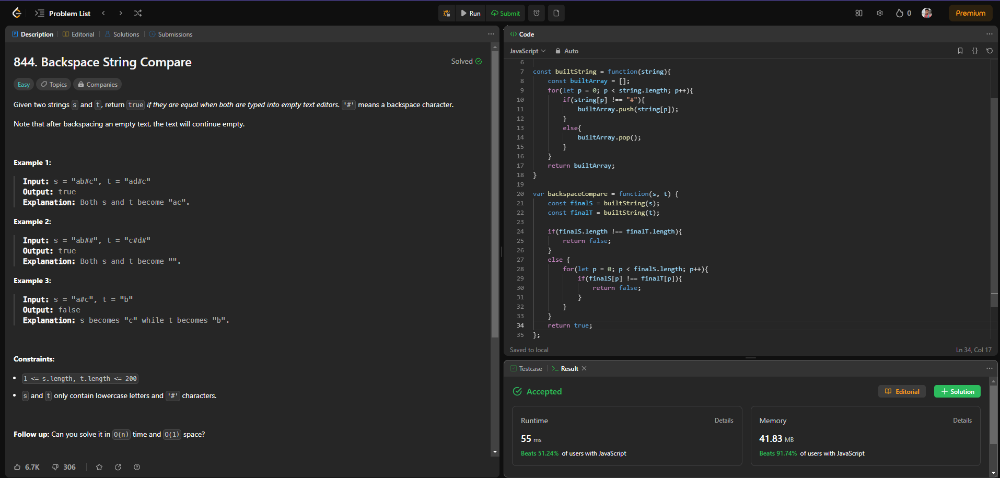
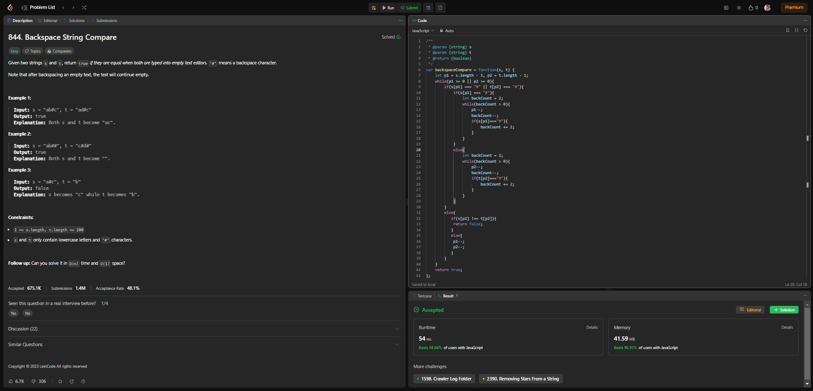

# Strings : Question #4 - Typed Out Strings (Easy)

You can check out the Question on LeetCode here  [Leetcode Backspace String Compare](https://leetcode.com/problems/backspace-string-compare/description/) before going throught the solution.

## Problem Statement

Given two strings `s` and `t`, return `true` *if they are equal when both are typed into empty text editors*. `'#'` means a backspace character.

Note that after backspacing an empty text, the text will continue empty.

<br>

**Example 1:**

> **Input:** `s = "ab#c", t = "ad#c"` <br>
**Output:** `true` <br>
**Explanation:** `Both s and t become "ac"`.

**Example 2:**

> **Input:** `s = "ab##", t = "c#d#"` <br>
**Output:** `true` <br>
**Explanation:** `Both s and t become ""`.

**Example 3:**

> **Input:** `s = "a#c", t = "b" `<br>
**Output:** `false` <br>
**Explanation:** `s becomes "c" while t becomes "b"`.
 

**Constraints:**

- `1 <= s.length, t.length <= 200`
- `s` and `t` only contain lowercase letters and `'#'` characters.
 

**Follow up:** Can you solve it in `O(n)` time and `O(1)` space?

<br>

### Personal note to make it more clear.
`#` is Backspace in the keyboard and you know what the backspace does when clicked just after a charecter is typed, it deletes the charecter and does `a#b` become `b` as a result and `a` is deleted.

-----------------------------------------------
<br>

## Process To Solve The Interview Problem.

### Step 1: Verify The Constraints

1. **Q : What happens when two #'s appear beside each other?** 
> Ans : Delete the two values before the first # (same as hitting backspace 2 times).
2. **Q : What happens to # when there is no character to remove?** 
> Ans : It deletes nothing then, just like backspace would.
3. **Does case sensitivity matter?**
> Ans : Yes it does, `"a"` does not equal `"A"`.

<br>

### Step 2: Write Out Some Testcases

*We are already provide with great testcases so we won't worry about that.*

<br>

### Step 3: Figure Out A Solution Without Code

We can do it as simply as possible we just need to make the whole string into an array and then we will check and store it into our new string. Whenever we encounter a `#` we are going to remove or pop out the previous charecter and then just store the two value to do the strict equality check.

<br>

### Step 4: Writing Our Brute Force Solution In Code

Let's write our Brute Force Solution in JavaScript using the DRY principle :-

```javascript
const builtString = function(string){
    const builtArray = [];
    for(let p = 0; p < string.length; p++){
        if(string[p] !== "#"){
            builtArray.push(string[p]);
        }
        else{
            builtArray.pop();
        }      
    }
    return builtArray;
}

const backspaceCompare = function(s, t) {
    const finalS = builtString(s);
    const finalT = builtString(t);

    if(finalS.length !== finalT.length){
        return false;
    }
    else { 
        for(let p = 0; p < finalS.length; p++){
            if(finalS[p] !== finalT[p]){
                return false;
            }
        }
    }
    return true;
}
```

We will check for syntax error and run a test case to check if our code is correct or not.

### Space & Time Complexity

Let's break down the code and analyze its time and space complexity step by step.

**`builtString` Function:**
- The `builtString` function processes a given string and builds a new string while handling backspaces.
- It uses an array (`builtArray`) to build the new string character by character.
- In the worst case, it iterates through the entire input string.
- Inside the loop, it performs push and pop operations on the array based on the character in the string.
- Therefore, the time complexity of `builtString` is O(n), where n is the length of the input string.
- The space complexity of `builtString` is also O(n) because it uses an array to store the characters.

**`backspaceCompare` Function:**
- The `backspaceCompare` function uses the `builtString` function to process both input strings `s` and `t`.
- After processing both strings, it compares the resulting strings for equality.
- The comparison step involves iterating through both processed strings.
- In the worst case, it iterates through the entire length of the two processed strings.
- Therefore, the time complexity of `backspaceCompare` is O(n + m), where n and m are the lengths of `s` and `t`, respectively.
- The space complexity of `backspaceCompare` is O(n + m) because it stores the processed strings in `finalS` and `finalT`, and the space used depends on the two strings.

In summary:
- The **`builtString` Function:** has a time and space complexity of O(n), where n is the length of the input string.
- The **`backspaceCompare` Function:** The time complexity of this function is O(n + m), where 'n' is the length of string 's' and 'm' is the length of string 't'. This is because it processes both strings separately, and when comparing the processed strings, it involves iterating through both 'finalS' and 'finalT', which could be of different lengths.

## Let's Check The Solution On Leetcode



But can we bring it down to `O(n)` time and `O(1)` space?

<br>

### Step 5: Can We Optimize Our Solution?

**Hints:**
- Utilize the original strings.
- Use the 2 pointer technique.
- Start from the end of the string!

Have you notice in our brute force solution we are creating an array for each `s` and `t` to match and check wheather they are same or not well we are choosing to do so but the problem just required to check wheather they are same or not so let's get rid of the extra storage.

Now you have two strings, `s` and `t`, and you want to check if they are the same when typed into a text editor, considering that someone might have used the backspace key ('#').

Here's how the code does it:

1. **Start at the End:**
   - Imagine you have a cursor at the end of both strings, `s` and `t`.
   - You start from the end because when you have a backspace, it erases a character to the left of the cursor.

2. **Comparison Loop:**
   - You begin a loop that continues until you reach the beginning of both strings (the leftmost part).
   - In other words, you go through the strings from right to left.

3. **Handling Backspace:**
   - If either of the characters under the cursors (`p1` for `s` and `p2` for `t`) is a backspace ('#'), you handle the backspace case:
     - You keep track of how many backspaces there are (usually 2 for each backspace).
     - You move the cursor to the left while skipping over backspaces.
   
4. **Character Comparison:**
   - When you no longer have backspaces or both characters under the cursors are not backspaces:
     - You compare the characters under the cursors (`s[p1]` and `t[p2]`).
     - If they are different, it means the strings are not equal, and you return `false`.
     - If they are the same, you move both cursors one step to the left to continue the comparison.

5. **Repeat Until the Beginning:**
   - You keep going through the strings, comparing characters and moving the cursors, until you've checked the entire strings from right to left.

6. **Result:**
   - If you reach the end of the loop without finding any differences, it means the strings are equal after considering backspaces, and you return `true`.

<br>

### Step 6: Writing Our Optimal Solution In Code

Let's write our Optimal Solution in JavaScript,

```javascript
const backspaceCompare = function(s, t) {
    let p1 = s.length - 1, p2 = t.length - 1;
    
    // Initialize two pointers, p1 and p2, starting from the end of both strings.

    while (p1 >= 0 || p2 >= 0) {
        // Start a loop that continues until both pointers reach the beginning of their respective strings.

        if (s[p1] === "#" || t[p2] === "#") {
            // If either of the characters at p1 or p2 is a backspace ('#'):

            if (s[p1] === "#") {
                // If the character at p1 is a backspace, handle backspacing in string s.

                let backCount = 2;
                while (backCount > 0) {
                    p1--;
                    backCount--;
                    if (s[p1] === "#") {
                        backCount += 2;
                    }
                }
                // This loop moves p1 backward while skipping over backspaces (counting them as they are encountered).
            } else {
                // If the character at p2 is a backspace, handle backspacing in string t (similar logic as for string s).

                let backCount = 2;
                while (backCount > 0) {
                    p2--;
                    backCount--;
                    if (t[p2] === "#") {
                        backCount += 2;
                    }
                }
            }
        } else {
            // If neither character is a backspace:

            if (s[p1] !== t[p2]) {
                // If the characters at p1 and p2 are not equal, return false.
                return false;
            } else {
                // If the characters are equal, move both pointers one step to the left.
                p1--;
                p2--;
            }
        }
    }
    
    // If the loop completes without returning false, it means the strings are equal after backspacing.
    return true;
}
```

Explanation:

- The code uses two pointers, `p1` and `p2`, initially set to the end of strings `s` and `t`, respectively.

- Inside the `while` loop, the code compares characters at the current positions of `p1` and `p2`:

  - If either character is a backspace (`#`), it enters a backspacing logic:
    - It counts the backspaces and moves the pointer backward while skipping over backspaces.

  - If neither character is a backspace, it compares the characters:
    - If they are not equal, the function returns `false` because the strings are not equal.
    - If they are equal, both pointers move one step to the left.

- The loop continues until both pointers have moved to the beginning of their respective strings.

- If the loop completes without returning `false`, it means the strings are equal after accounting for backspaces, and the function returns `true`.

This code efficiently handles backspaces and compares the strings in a single pass through both strings, making it an optimal solution for this problem.

**Time Complexity:** O(n + m)
- The code iterates through both strings `s` and `t` once, where `n` is the length of `s` and `m` is the length of `t`.
- Therefore, the time complexity is O(n + m).

**Space Complexity:** O(1)
- The code uses a constant amount of additional space, regardless of the size of the input strings. It only requires a few variables (`p1`, `p2`, `backCount`, etc.), and the space complexity is therefore O(1), indicating constant space complexity.

## Let's Check The Solution On Leetcode



#### And this is how we solve the **Backspace String Compare** problem.